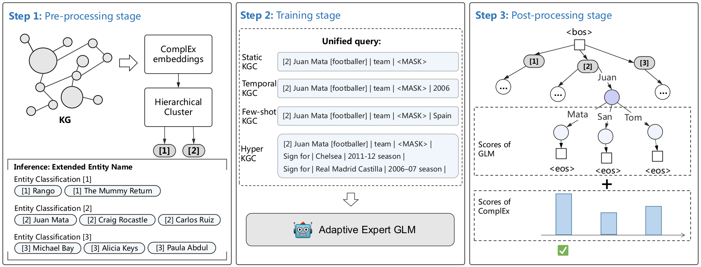

<h1 align="center">
  OneForKG
</h1>

<h4 align="center">OneForKG: A Unified and Effective Framework for Various Knowledge Graph Completion</h4>

<h2 align="center">
  Overview of OneForKG
  
</h2>
This repository includes the source code of the paper submitted to TKDE. 


### Dependencies

- Compatible with PyTorch 1.11.0 and Python 3.x.
- Dependencies can be installed using `requirements.txt`.

### Dataset:

- We use WN18RR, FB15k-237, ICEWS14, WikiPeople and NELL-One dataset for knowledge graph link prediction. 
- All the preprocessed data are included in the `./data/processed/` directory.


### Results:
The results are:

|   Dataset   |  MRR  |  H@1  |  H@3  | H@10  | 
|:-----------:|:-----:|:-----:|:-----:|:-----:|
|   WN18RR    | 0.586 | 0.546 | 0.61  | 0.667 | 
|  FB15k-237  | 0.361 | 0.281 | 0.401 | 0.527 | 
|   ICEWS14   | 0.613 | 0.538 | 0.661 | 0.75  | 
| WikiPeople  | 0.422 | 0.346 | 0.467 | 0.559 |

| Dataset |  MRR  |  H@1  |  H@5  | H@10  |
|:-------:|:-----:|:-----:|:-----:|:-----:|
|  NELL   | 0.358 | 0.282 | 0.433 | 0.505 | 


### Training and testing:

- Install all the requirements from `./requirements.txt.`
- Commands for reproducing the reported results:
  ##### WN18RR
 ```shell
  python3 main.py -dataset WN18RR \
                  -lr 0.0005 \
                  -epoch 110 \
                  -batch_size 32 \
                  -src_descrip_max_length 40 \
                  -tgt_descrip_max_length 10 \
                  -seq_dropout 0 \
                  -num_beams 40 \
                  -eval_tgt_max_length 30 \
                  -skip_n_val_epoch 60  \
                  -pretrainKG 0 \
                  -istrain 1 \
                  -complex_dataset complex_wn18rr1536  \
                  -n_aggcluster 30   \
                  -e 3 
  
  # evaluation commandline:
  python3 main.py -dataset WN18RR \
                  -src_descrip_max_length 40 \
                  -tgt_descrip_max_length 10 \
                  -num_beams 40 \
                  -eval_tgt_max_length 30 \
                  -model_path pathtomodel  \
                  -use_prefix_search \
                  -istrain 0 \
                  -pretrainKG 0  \
                  -complex_dataset complex_wn18rr1536  \
                  -n_aggcluster 30   \
                  -e 3  \
                  -w_SBeam 0.005
  ```
 
  ##### FB15k-237
  ```shell
  python3 main.py -dataset FB15k-237  \
                  -lr 0.001 \
                  -epoch 40 \
                  -batch_size 16 \
                  -src_descrip_max_length 80 \
                  -tgt_descrip_max_length 80 \
                  -seq_dropout 0 \
                  -num_beams 40 \
                  -eval_tgt_max_length 30 \
                  -skip_n_val_epoch 20 \
                  -pretrainKG 0 \
                  -istrain 1  \
                  -complex_dataset complex_fb15k237-1536 \
                  -n_aggcluster 500
                  -e 3 
  # evaluation commandline:
  python3 main.py -dataset FB15k-237 \
                  -src_descrip_max_length 80 \
                  -tgt_descrip_max_length 80 \
                  -num_beams 40 \
                  -eval_tgt_max_length 30 \
                  -model_path pathtomodel  \
                  -pretrainKG 0 \
                  -istrain 0  \
                  -complex_dataset complex_fb15k237-1536 \
                  -n_aggcluster 30  \
                  -w_SBeam 0.1  \
                  -e 3  \
                  -use_prefix_search
  ```

  ##### ICEWS14
  ```shell
  python3 main.py -dataset ICEWS14 \
                  -lr 0.0005   \
                  -epoch 100    \
                  -batch_size 16    \
                  -src_descrip_max_length  40  \
                  -tgt_descrip_max_length 40    \
                  -temporal    \
                  -seq_dropout 0   \
                  -num_beams 40   \
                  -eval_tgt_max_length 26     \
                  -skip_n_val_epoch 50  \
                  -pretrainKG 0 \
                  -istrain 1 \
                  -complex_dataset complex_icews14-1536  \
                  -n_aggcluster 100
                  -e 3 
  
  # evaluation commandline:
  python3 main.py -dataset ICEWS14 \
                  -src_descrip_max_length 40 \
                  -tgt_descrip_max_length 40 \
                  -num_beams 40 \
                  -eval_tgt_max_length 26 \
                  -model_path pathtomodel \
                  -use_prefix_search \
                  -istrain 0 \
                  -pretrainKG 0 \
                  -temporal \
                  -complex_dataset complex_icews14-1536  \
                  -n_aggcluster 10  \
                  -w_SBeam  0.005   \
                  -e 3
  ```
   ##### WikiPeople
  ```shell
  python3 main_wikipeople.py  -dataset WikiPeople  \
                              -lr 0.001 \
                              -epoch 40 \
                              -batch_size 32 \
                              -src_descrip_max_length 0 \
                              -tgt_descrip_max_length 0 \
                              -seq_dropout 0 \
                              -num_beams 40 \
                              -eval_tgt_max_length 30 \
                              -skip_n_val_epoch 20 \
                              -pretrainKG 0 \
                              -istrain 1  \
                              -complex_dataset complex_wikipeople-1536 \
                              -n_aggcluster 30  \
                              -src_max_length  1024   \
                              -e 3
  
  # evaluation commandline:
  python3 main_wikipeople.py  -dataset WikiPeople \
                              -src_descrip_max_length 0 \
                              -tgt_descrip_max_length 0 \
                              -num_beams 40 \
                              -eval_tgt_max_length 30 \
                              -model_path pathtomodel  \
                              -use_prefix_search  \
                              -istrain 0 \
                              -pretrainKG 0  \
                              -complex_dataset complex_wikipeople-1536  \
                              -n_aggcluster 30  \
                              -src_max_length 1024  \
                              -w_SBeam 0.05   \
                              -e 3
  ```
  ##### NELL-One
  ```shell
  python3 main.py -dataset NELL \
                  -lr 0.0005   \
                  -epoch 45    \
                  -batch_size 64    \
                  -src_descrip_max_length  0  \
                  -tgt_descrip_max_length 0  \
                  -num_beams 40   \
                  -eval_tgt_max_length 25     \
                  -skip_n_val_epoch 25  \
                  -pretrainKG 0 \
                  -istrain 1   \
                  -complex_dataset complex_nell-1536  \
                  -n_aggcluster 30  \
                  -e 8  \
  
  # evaluation commandline:
  python3 main.py -dataset NELL \
                  -src_descrip_max_length 0 \
                  -tgt_descrip_max_length 0 \
                  -num_beams 40 \
                  -eval_tgt_max_length 25 \
                  -model_path pathtomodel \
                  -use_prefix_search \
                  -istrain 0 \
                  -pretrainKG 0 \
                  -complex_dataset complex_nell-1536  \
                  -n_aggcluster 30 \
                  -e 8 
                  
    
  ```
  - `-src_descrip_max_length` denotes the training batch size
  - `-src_descrip_max_length` denotes the maximum description length for source entity during training 
  - `-tgt_descrip_max_length` denotes the maximum description length for target entity during training
  - `-eval_tgt_max_length` denotes the maximum description length for generation during inference
  - `-use_prefix_search` denotes to use constrained decoding method
  - `-temporal` denotes the dataset is for temporal knowledge graph completion
  - `-skip_n_val_epoch` denotes the number of training epochs without evaluation (evaluation is costly due to the auto-regressive decoding) 
  - `-e` denotes the number of expert
  - `-n_aggcluster` denotes the number of cluster
  - `-w_SBeam` denotes the weight factor